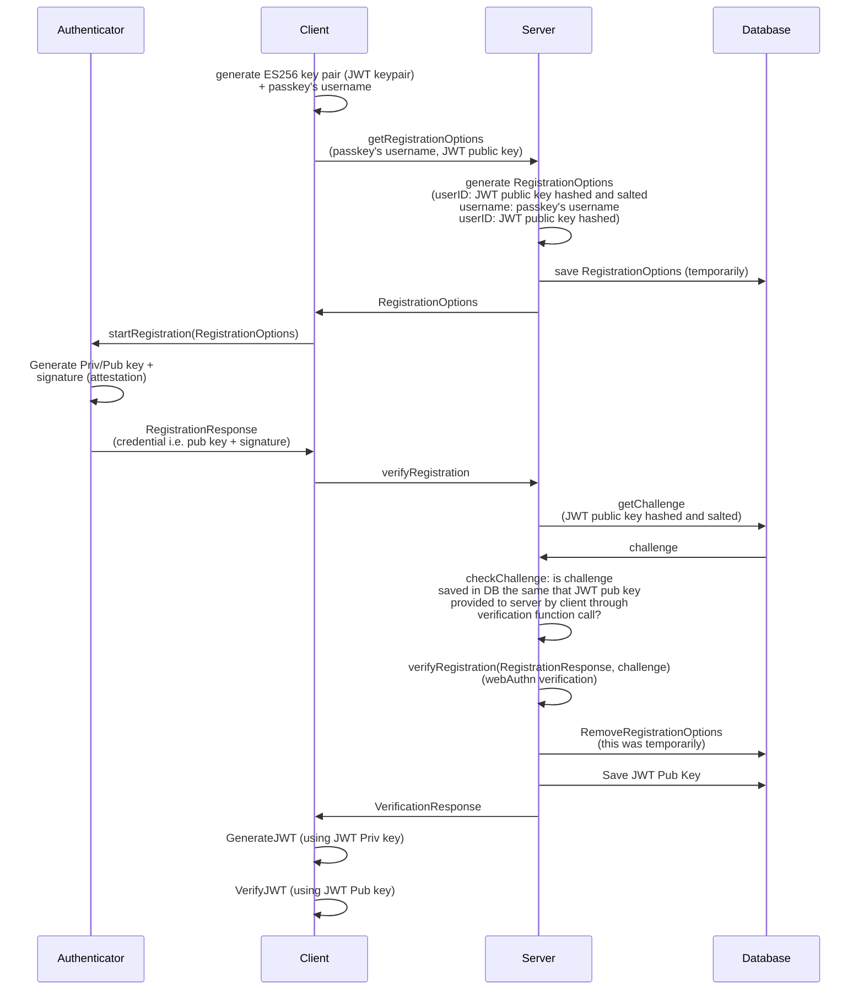

# SimpleWebAuthn Passkeys + TACo PoC

This is a Next.js app that implements passkeys using [SimpleWebAuthn](https://github.com/MasterKale/SimpleWebAuthn)
and JSON Web Tokens.

## PoC walkthrough

This PoC perform the following steps:

Passkey registration:

1. Browser generates a ES256 key pair (ECDSA + P-256): JWT private key + JWT
public key. The private key is not sent to server.
2. Browser start passkey registration. The JWT public key is hashed and this is used
as Passkey userID and challange.
3. JWT Public key is save in server's database, binded to the Passkeys's credential
ID and username.

JWT generation:
4. User introduces a JSON to be signed in browser.
5. Browser uses the JWT private key to sign the JSON and to generate the JWT.

JWT verification:
6. Browser uses the JWT public key to verify the JWT.

### Detailed flow



## Usage

Recommended node version: v20.

```bash
npm install
# or
pnpm install
```

[http://localhost:3000](http://localhost:3000)

## Development

Note that, in the code, the code run by the server is in the `src/lib` and
`src/components` directories, while the code run by the client is in the `src/app`
directory.

For simplicity sake, no DB has been integrated in the PoC:

- JWT public keys and passkey's registration options are saved in a JSON file (database.json)
- Passkey's User credentials are saved on a React state.
