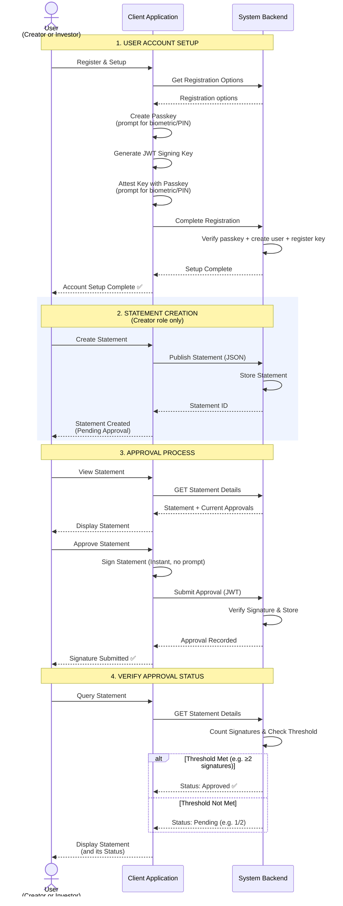

# High-Level Statement Approval Flow

This diagram illustrates the business logic and high-level interactions for the statement approval process, abstracting away the cryptographic details.

## Key Concepts

1.  **One-Time Setup (2 API Calls)**: Users set up their account with just 2 API calls:
    - `POST /api/credentials` - Get passkey registration options
    - `POST /api/register/complete` - Verify passkey + create user + register JWT key
2.  **Statement Creation**: Only Creators can create statements.
3.  **Instant Approval**: Any user can approve statements instantly—no biometric prompt needed after setup.
4.  **Threshold Logic**: Status is calculated on query by counting signatures.
