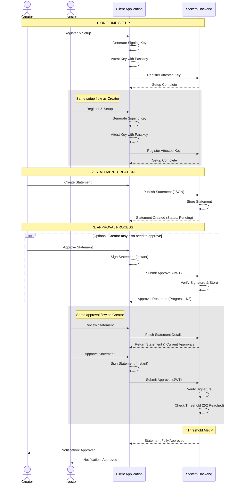

# High-Level Statement Approval Flow

This diagram illustrates the business logic and high-level interactions for the statement approval process, abstracting away the cryptographic details.

## Key Concepts

1.  **One-Time Setup**: Users (Creators and Investors) set up their account once. This links a fast signing key to their secure passkey.
2.  **Statement Creation**: A Creator defines the statement (e.g., investment terms).
3.  **Instant Approval**: Users can approve statements instantly. The "Signing" happens automatically in the background using the setup from step 1.
4.  **Threshold Logic**: The system waits until enough approvals (e.g., 2 out of 2) are collected before marking the statement as valid.
