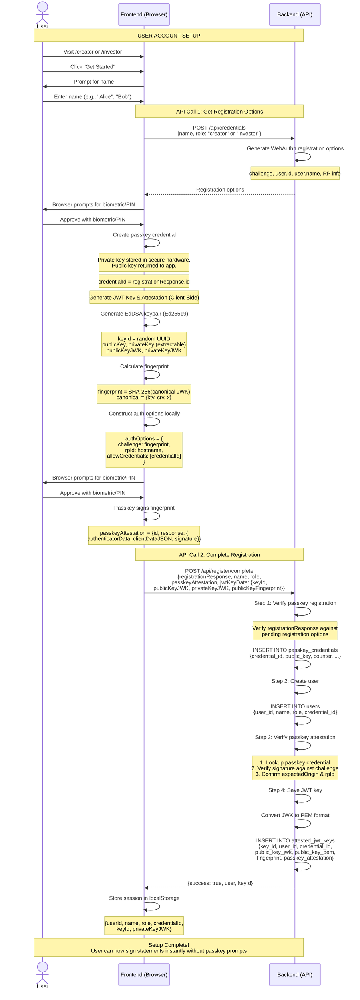
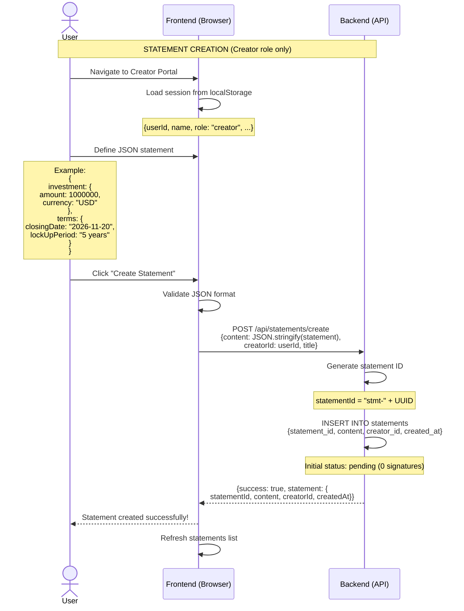
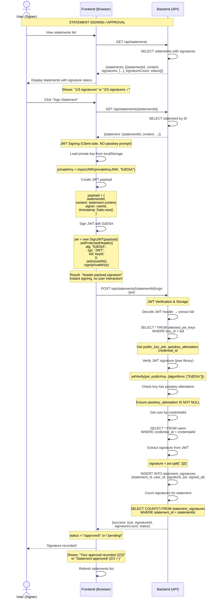
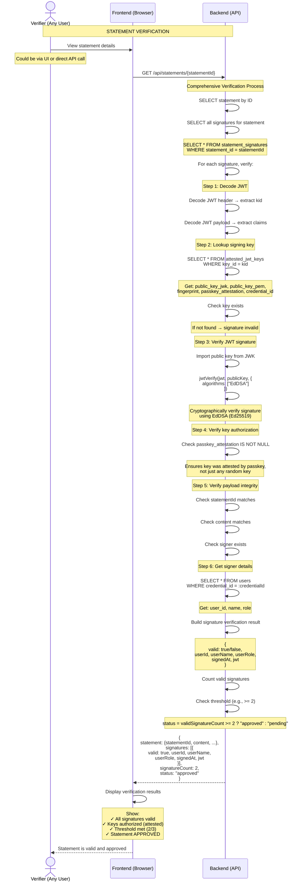

# Statement Approval Flow - Sequence Diagrams

This document contains four sequence diagrams showing the complete flow for statement creation, signing, and verification with passkey-attested JWT keys.

## Table of Contents

- [Statement Approval Flow - Sequence Diagrams](#statement-approval-flow---sequence-diagrams)
  - [Table of Contents](#table-of-contents)
  - [1. User Registration \& Key Setup](#1-user-registration--key-setup)
    - [Key Points](#key-points)
  - [2. Statement Creation](#2-statement-creation)
    - [Key Points](#key-points-1)
  - [3. Statement Signing / Approval](#3-statement-signing--approval)
    - [Key Points](#key-points-2)
  - [4. Statement Verification](#4-statement-verification)
    - [Key Points](#key-points-3)
  - [Summary](#summary)
    - [Flow Overview](#flow-overview)
    - [Security Model](#security-model)
    - [Key Benefits](#key-benefits)
    - [API Endpoints Reference](#api-endpoints-reference)

---

## 1. User Registration & Key Setup

This diagram shows the one-time setup process that any user (Creator or Investor) must complete before they can sign statements.

### Key Points

- **One-time process**: Users only do this setup once per device/browser
- **Two API calls**: Get options → Complete registration
- **Two biometric prompts**: One for passkey registration, one for JWT key attestation
- **Client-side auth options**: Authentication options for attestation are constructed locally
- **Result**: User has an attested JWT signing key stored locally
- **Security**: JWT key's legitimacy is cryptographically proven by passkey attestation

---

## 2. Statement Creation

This diagram shows how a Creator defines and submits a new statement for approval.

### Key Points

- **Creator only**: Only users with role "creator" can create statements
- **JSON content**: Statement can contain any valid JSON structure
- **Initial state**: Statement starts with 0 signatures (pending)
- **No signing yet**: Creation and signing are separate actions

---

## 3. Statement Signing / Approval

This diagram shows how any user (Creator or Investor) signs a statement to approve it.

### Key Points

- **Any user**: Both Creators and Investors can sign statements
- **No passkey prompt**: JWT signing happens instantly using stored private key
- **Client-side signing**: JWT is created in the browser, not on the server
- **Backend verification**: Server verifies JWT signature and checks attestation
- **Threshold check**: Statement becomes valid when threshold (2/3) is reached
- **One signature per user**: Each user can only sign a statement once

---

## 4. Statement Verification

This diagram shows how anyone can verify a statement's signatures and validity.

### Key Points

- **Anyone can verify**: Verification is public and doesn't require authentication
- **Multi-step verification**: Each signature goes through 6 verification steps
- **Cryptographic proof**: JWT signatures are verified using EdDSA algorithm
- **Attestation check**: System ensures signing keys were attested by passkeys
- **Threshold validation**: Statement is only valid if threshold (2/3) is met
- **Standard JWT**: Uses standard JWT verification (jose library)

---

## Summary

### Flow Overview

1. **Setup** (one-time): User registers passkey → Creates account → Generates JWT key → Attests with passkey
2. **Create** (Creator): Draft JSON statement → Submit to backend → Store in database
3. **Sign** (Any user): View statement → Sign JWT locally (instant) → Submit to backend → Verify & store
4. **Verify** (Anyone): Fetch statement → Backend validates all signatures → Check threshold → Return result

### Security Model

| Layer         | Purpose                   | Technology                 |
| ------------- | ------------------------- | -------------------------- |
| **Passkey**   | Proves JWT key legitimacy | WebAuthn, Hardware-backed  |
| **JWT**       | Fast, standard signatures | EdDSA (Ed25519)            |
| **Threshold** | Multi-party approval      | 2-of-3 signatures required |

### Key Benefits

- **Security**: Hardware-backed passkey attestation proves key legitimacy
- **Efficiency**: No biometric prompts for every signature (only during setup)
- **Standard**: Uses standard JWT format, verifiable with any JWT library
- **Collaborative**: Multiple parties must approve (threshold-based)

### API Endpoints Reference

| Endpoint                    | Method | Purpose                                         |
| --------------------------- | ------ | ----------------------------------------------- |
| `/api/credentials`          | POST   | Generate passkey registration options           |
| `/api/register/complete`    | POST   | Verify passkey + create user + register JWT key |
| `/api/authenticate/options` | POST   | Generate passkey authentication challenge       |
| `/api/statements/create`    | POST   | Create new statement                            |
| `/api/statements`           | GET    | List all statements                             |
| `/api/statements/{id}`      | GET    | Get statement details with signatures           |
| `/api/statements/{id}/sign` | POST   | Sign statement with JWT                         |
